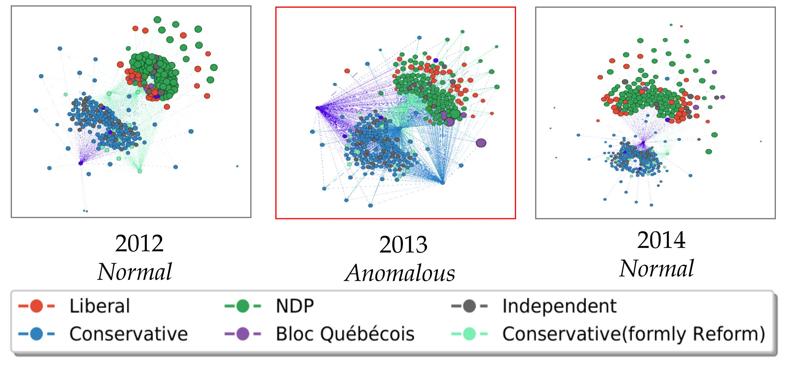

*{{ page.names }}*

**{{ page.venue }}**



If you have any questions, please reach out to me by [email](mailto:shenyang.huang@mail.mcgill.ca)

## Problem : Identifying anomalous snapshots in a dynamic graph.

## Contributions

1. proposed Laplacian Anomaly Detection (LAD): a novel change point detection method that summarizes each graph snapshot with the singular values of the graph Laplacian
2. LAD explicitly captures both the short term and the long term temporal relations to model the abrupt and gradual changes in dynamic networks
3. Extensively evaluated LAD on synthetic and real world experiments and showed that LAD outperforms state-of-theart methods

## Data:
All data is avaible in github repository

1. Canadian bill voting network (original political network documenting interation between Members of Parliament in Canada)
2. US Senate co-sponsorship network
3. UCI Message social network

## Abstract

Dynamic and temporal graphs are rich data structures that are used to model complex relationships between entities over time. In particular, anomaly detection in temporal graphs is crucial for many real world applications such as intrusion identification in network systems, detection of ecosystem disturbances and detection of epidemic outbreaks. In this paper, we focus on change point detection in dynamic graphs and address two main challenges associated with this problem: I) how to compare graph snapshots across time, II) how to capture temporal dependencies. To solve the above challenges, we propose Laplacian Anomaly Detection (LAD) which uses the spectrum of the Laplacian matrix of the graph structure at each snapshot to obtain low dimensional embeddings. LAD explicitly models short term and long term dependencies by applying two sliding windows. In synthetic experiments, LAD outperforms the state-of-the-art method. We also evaluate our method on three real dynamic networks: UCI message network, US senate co-sponsorship network and Canadian bill voting network. In all three datasets, we demonstrate that our method can more effectively identify anomalous time points according to significant real world events.